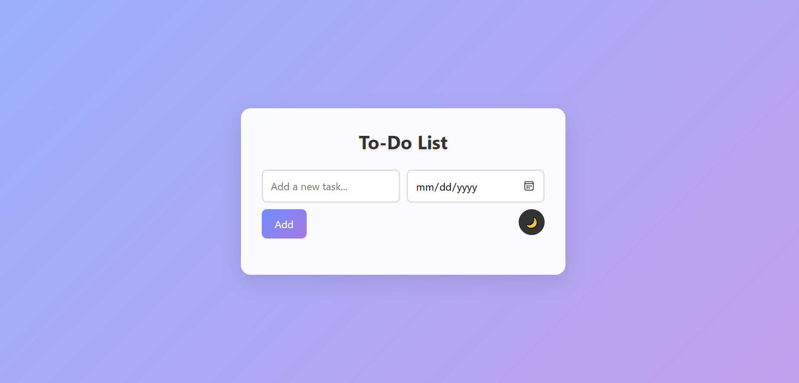

# 🌟 Modern To-Do List App

A sleek and feature-rich to-do list application designed to help you stay organized and productive. This app combines a beautiful user interface with powerful task management features.

## ✨ Features

- **Add Tasks**: Quickly add tasks with optional due dates.
- **Edit Tasks**: Double-click on a task to edit it seamlessly.
- **Mark as Complete**: Check off tasks as you complete them.
- **Delete Tasks**: Remove tasks with a single click.
- **Dark Mode**: Toggle between light and dark themes for a personalized experience.
- **Responsive Design**: Fully optimized for desktop and mobile devices.
- **Local Storage**: Automatically saves your tasks, so you never lose them.

## 🎨 Screenshots

### Light Mode


### Dark Mode


> **Note**: Replace the above placeholders with actual screenshots saved in a `screenshots` folder in your project directory.

## 🚀 Getting Started

1. Clone the repository:
   ```bash
   git clone https://github.com/heshan123vitharana/To-Do-List-App.git
   ```
2. Open the `To Do List App.html` file in your browser.

## 🛠️ Technologies Used

- **HTML5**: For the structure of the app.
- **CSS3**: For the modern and responsive design.
- **JavaScript**: For task management and interactivity.
- **Local Storage**: To persist tasks across sessions.

## 📂 Project Structure

```
To-Do-List-App/
├── README.md
├── To Do List App.html
├── screenshots/
│   ├── light-mode.png
│   ├── dark-mode.png
```

## 🌐 Live Demo

Check out the live demo [here](https://your-live-demo-link.com).

## 🤝 Contributing

Contributions are welcome! Feel free to fork the repository and submit a pull request.

## 📄 License

This project is licensed under the MIT License. See the full license below:

---

### MIT License

```
MIT License

Copyright (c) 2025 Heshan Witharana

Permission is hereby granted, free of charge, to any person obtaining a copy
of this software and associated documentation files (the "Software"), to deal
in the Software without restriction, including without limitation the rights
to use, copy, modify, merge, publish, distribute, sublicense, and/or sell
copies of the Software, and to permit persons to whom the Software is
furnished to do so, subject to the following conditions:

The above copyright notice and this permission notice shall be included in all
copies or substantial portions of the Software.

THE SOFTWARE IS PROVIDED "AS IS", WITHOUT WARRANTY OF ANY KIND, EXPRESS OR
IMPLIED, INCLUDING BUT NOT LIMITED TO THE WARRANTIES OF MERCHANTABILITY,
FITNESS FOR A PARTICULAR PURPOSE AND NONINFRINGEMENT. IN NO EVENT SHALL THE
AUTHORS OR COPYRIGHT HOLDERS BE LIABLE FOR ANY CLAIM, DAMAGES OR OTHER
LIABILITY, WHETHER IN AN ACTION OF CONTRACT, TORT OR OTHERWISE, ARISING FROM,
OUT OF OR IN CONNECTION WITH THE SOFTWARE OR THE USE OR OTHER DEALINGS IN THE
SOFTWARE.
```

---

Made with ❤️ by [Heshan Witharana](https://github.com/heshan123vitharana)
```
